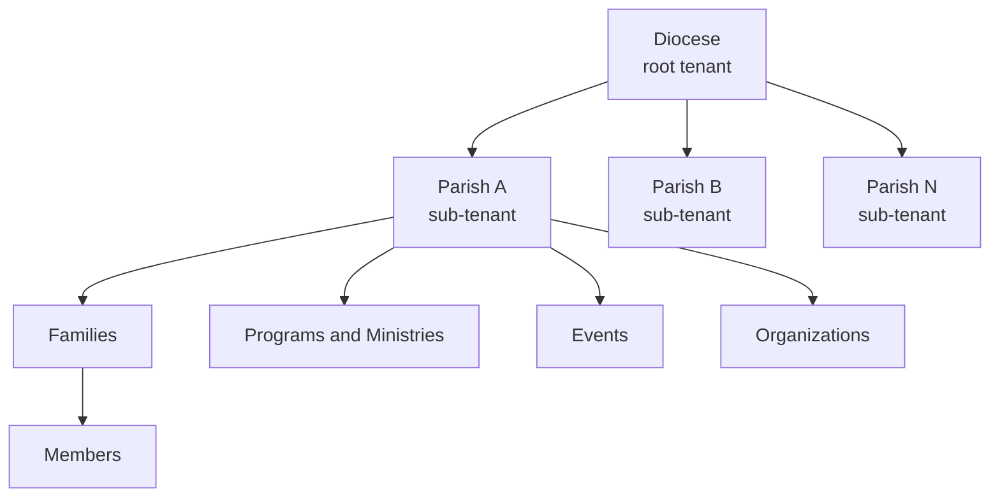
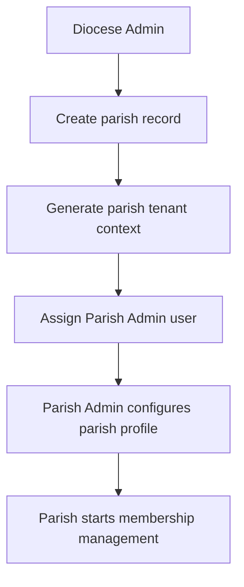
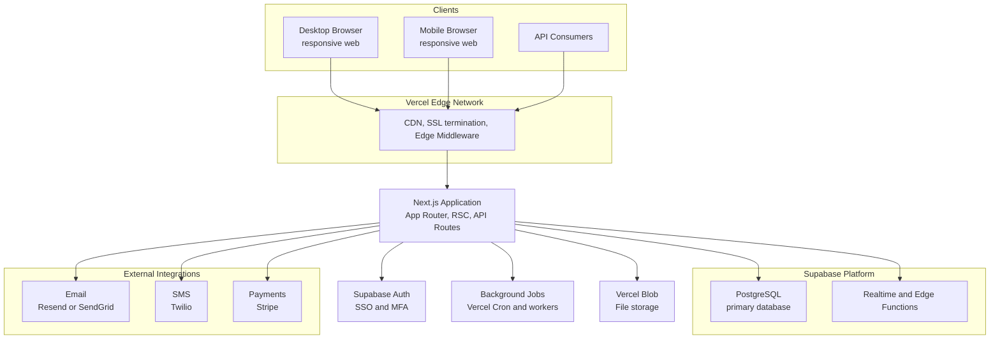
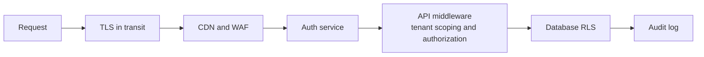
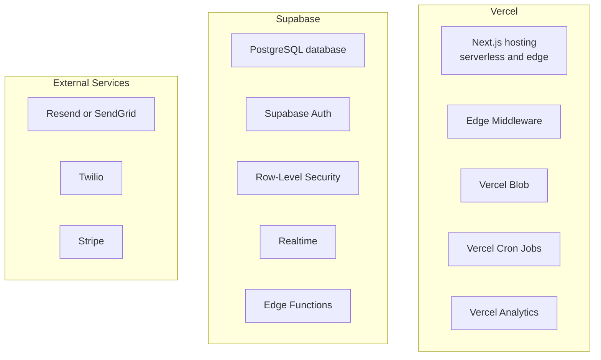
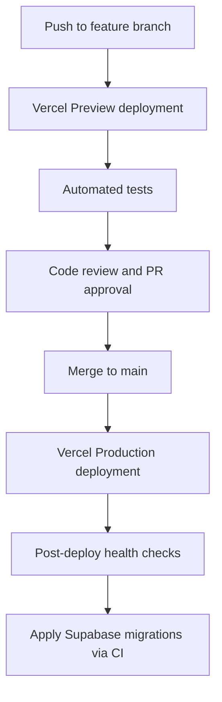
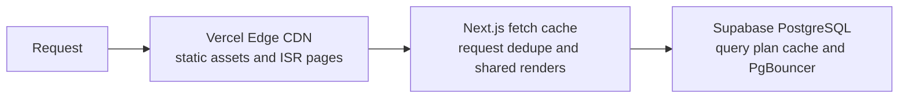

# System Architecture

## Overview

The Mar Thoma Church Management System (CMS) for the Diocese of North America is a **multi-tenant web application** built on a hierarchical tenancy model: one diocese containing multiple parishes. This document describes the system architecture, confirmed technology choices, and key architectural decisions.

---

## 1. Tenancy Model

### 1.1 Hierarchy



### 1.2 Tenancy Strategy

The system uses a **shared database, shared schema with tenant discriminator** strategy:

- Every major table includes a `parish_id` foreign key (and implicitly a `diocese_id`).
- Diocese-level entities carry only `diocese_id`.
- Application-level middleware enforces tenant scoping on every query.
- A dedicated **Diocese Admin** role can query across all parishes for reporting purposes (read-only aggregate queries).

**Rationale:** This approach balances operational simplicity (single schema to maintain) with scalability (can migrate to per-tenant schemas or databases later if needed).

> **Future consideration:** If data isolation requirements increase (e.g., supporting multiple dioceses), each diocese can be migrated to its own database instance.

### 1.3 Tenant Provisioning



---

## 2. High-Level Architecture



---

## 3. Component Descriptions

### 3.1 Frontend (Web Application)

- **Framework:** Next.js (App Router with React Server Components)
- **UI Library:** shadcn/ui (built on Radix UI + Tailwind CSS)
- **Hosting:** Vercel
- **Responsibilities:**
  - Diocesan admin portal
  - Parish admin portal
  - Member self-service portal
  - **Fully responsive layout supporting desktop, tablet, and mobile browsers**
- **Key Considerations:**
  - Role-aware navigation (menus differ by user role and tenant level)
  - A global **Share** entry in the top menu bar on every page where the user can share the current resource context
  - Tenant context carried in Supabase session JWT claims
  - Server Components for data-heavy views; Client Components for interactive UI
  - shadcn/ui components are customized per the diocese branding theme

> **Mobile strategy:** The web app is the primary interface for all platforms via responsive design. A separate **Expo mobile app** is planned as a future project to add offline capability and native device features.

### 3.2 API Layer

- **Style:** Next.js API Routes (Route Handlers in App Router)
- **Responsibilities:**
  - Business logic enforcement
  - Tenant isolation middleware (all queries scoped to current tenant via Supabase RLS)
  - Input validation and error handling
  - Share workflow orchestration (recipient validation, anonymization policy enforcement, link token issuance/revocation)
  - Rate limiting per tenant (via Vercel Edge Middleware)
- **Authentication:** Supabase Auth JWT, verified server-side via Supabase SSR client

### 3.2.1 Universal Sharing Workflow (Cross-Cutting)

The sharing workflow is a cross-cutting capability available from a top-bar Share action across supported pages.

**Share modes:**

- `user_share`: Share to one or more specific internal users.
- `role_share`: Share to role-scoped recipients within tenant boundaries.
- `secure_link`: Share via time-limited tokenized link.

**Secure link controls:**

- Expiration date/time (required for anonymous links)
- Optional max views
- Immediate revocation
- Optional anonymized projection (resource-specific de-identification profile)

**Enforcement path:**

- The UI never authorizes sharing by itself; the API validates permissions and share policy for each create/read/revoke action.
- Secure link tokens are stored hashed in the database and compared server-side.
- Access to user-scoped shares requires authenticated identity and recipient match.

### 3.3 Auth Service — Supabase Auth

- **Provider:** Supabase Auth
- **Responsibilities:**
  - Email/password authentication
  - SSO via OAuth 2.0 / OIDC (Google Workspace, Microsoft Entra)
  - MFA enforcement (TOTP)
  - Session management and JWT refresh
  - User management (invite, deactivate, password reset)
- **Integration:** Supabase Auth JWTs carry custom claims (`diocese_id`, `parish_id`, `roles`) injected via a Supabase Auth hook (PostgreSQL function or Edge Function)

### 3.4 Background Job Queue

- **Responsibilities:**
  - Sending bulk email/SMS communications
  - Generating large reports (PDF, Excel)
  - Importing member data from CSV uploads
  - Sending scheduled reminders (event reminders, anniversary notifications)
- **Technology:** Vercel Cron Jobs for scheduled tasks; Supabase Edge Functions or Vercel background functions for queue processing. Third-party queue (Inngest or similar) if more complex job orchestration is needed.

### 3.5 Primary Database — Supabase PostgreSQL

- **Type:** PostgreSQL (managed by Supabase)
- **Tenant Isolation:** Supabase Row-Level Security (RLS) policies enforced at DB level — all queries are automatically scoped to the authenticated user's tenant
- **Key Schemas:**
  - `diocese` — diocese-level entities
  - `parish` — parish-level entities
  - `membership` — families and members
  - `sacraments` — sacramental records
  - `ledger` — full financial ledger (accounts, journal entries, transactions)
  - `giving` — giving campaigns, donations, and pledges
  - `events` — events and scheduling
  - `communications` — message history
  - `audit` — audit log

### 3.6 File Storage — Vercel Blob

- **Provider:** Vercel Blob
- **Responsibilities:**
  - Member photos
  - Parish documents (bulletins, policies)
  - Report exports (PDF, Excel)
  - Imported CSV files
- **Access:** Signed URLs generated server-side; objects stored with per-tenant path prefix (`/{diocese_id}/{parish_id}/...`)

### 3.7 Cache

- **Provider:** Vercel Data Cache (built into Next.js fetch caching) + Supabase query caching
- **Responsibilities:**
  - Cached server-side fetches for reference data (liturgical calendar, parish profile)
  - Next.js ISR / on-demand revalidation for semi-static pages
- **Note:** Dedicated Redis is not required initially; Vercel's built-in caching is sufficient for v1.

---

## 4. Security Architecture

### 4.1 Defense in Depth



### 4.2 JWT Structure

```json
{
  "sub": "user-uuid",
  "email": "admin@stmary.diocese.org",
  "diocese_id": "uuid-diocese",
  "parish_id": "uuid-parish", // null for diocese-level admins
  "roles": ["parish_admin"],
  "iat": 1700000000,
  "exp": 1700003600
}
```

### 4.3 Data Isolation Rules

The system enforces a **Parish Data Sovereignty** model. Access to parish data is divided into three tiers:

**Tier 1 — Always visible to diocese (no grant required):**

| Actor                                 | Can Access                                                                                            |
| ------------------------------------- | ----------------------------------------------------------------------------------------------------- |
| Diocese Admin / Staff / Report Viewer | Parish profile, status, structural metadata                                                           |
| Diocese Admin / Staff / Report Viewer | Aggregate/anonymized metrics (member counts, sacrament counts, giving totals — no individual records) |

**Tier 2 — Visible only with an active DataSharingGrant:**

| Actor                 | Can Access (when grant exists for that category)                                             |
| --------------------- | -------------------------------------------------------------------------------------------- |
| Diocese Admin         | Raw parish records (members, families, sacramental, giving, ledger) for the granted category |
| Diocese Staff         | Raw parish records for categories explicitly granted with `diocese_staff` role filter        |
| Diocese Report Viewer | Summary-scoped or period-scoped reports only; never full raw records                         |

**Tier 3 — Parish-only (no external access regardless of grants):**

| Actor           | Can Access                                     |
| --------------- | ---------------------------------------------- |
| Parish Admin    | Own parish — all records, full read/write      |
| Parish Staff    | Own parish — configurable scope                |
| Ministry Leader | Own parish — own program/ministry members only |
| Member          | Own profile and own family record only         |
| Anonymous       | Login page only                                |

**Cross-parish boundary rules:**

- Parish A has **zero visibility** into Parish B data under any circumstance.
- The only defined cross-parish flows are: (a) member transfer (structured workflow, minimum data exposure), (b) diocese program enrollment (name + status only), (c) joint events (aggregate attendance only).

> **See [access-control.md](access-control.md)** for the full parish data sovereignty model, sharing grant mechanics, RLS policy patterns, and audit requirements.

### 4.4 Audit Logging Architecture

Audit logging is treated as a core security control, not an optional analytics feature.

**Coverage requirements:**

- Every authenticated operation emits an audit event (read/write/delete/export/import/permission change).
- Authentication and session lifecycle events (login success/failure, logout, MFA challenge result) are always logged.
- System-initiated actions (cron jobs, webhooks, background workers) emit events with actor type `system`.

**Write path and durability:**

- Security-critical actions synchronously persist an audit entry within the same request lifecycle before response completion.
- Non-critical high-volume events may be buffered through a durable queue, but replay is mandatory and loss is not acceptable.
- If the queue/replay subsystem is degraded, the platform raises operational alerts and tracks ingestion lag.

**Integrity and governance:**

- Audit storage is append-only from the application perspective (no update/delete endpoints for historical entries).
- Correlation IDs tie related events across UI requests, API calls, and async jobs.
- Redaction is enforced at write time for secrets and sensitive credential material.

---

## 5. Deployment Architecture

### 5.1 Environments

| Environment | Purpose                                                                   |
| ----------- | ------------------------------------------------------------------------- |
| Development | Local developer machines (Supabase local via `supabase start`)            |
| Preview     | Vercel preview deployments per PR (linked to a staging Supabase project)  |
| Production  | Live Vercel production deployment (linked to production Supabase project) |

### 5.2 Infrastructure Stack



### 5.3 CI/CD Pipeline



---

## 6. Integration Points

| Integration           | Purpose                   | Provider                                         | Protocol             |
| --------------------- | ------------------------- | ------------------------------------------------ | -------------------- |
| Authentication        | User login, SSO, MFA      | Supabase Auth                                    | Built-in             |
| Database              | Primary data store        | Supabase PostgreSQL                              | Supabase client SDK  |
| File storage          | Blobs, photos, exports    | Vercel Blob                                      | HTTPS API            |
| Email (transactional) | Invites, notifications    | Resend or SendGrid                               | HTTPS API            |
| Email (bulk)          | Parish communications     | Resend or SendGrid                               | HTTPS API            |
| SMS                   | Notification messages     | Twilio                                           | HTTPS API            |
| Push notifications    | In-app / browser push     | Web Push API (future)                            | HTTPS                |
| Payment processing    | Online giving             | Stripe                                           | HTTPS API + Webhooks |
| Accounting export     | Export giving/ledger data | External accounting workflows (optional, future) | CSV export           |
| SSO providers         | Staff login               | Google Workspace, Microsoft Entra                | OAuth 2.0 / OIDC     |
| Calendar export       | Event sync                | Standard iCal format                             | iCal (.ics)          |
| Expo mobile app       | Offline mobile experience | Separate project (future)                        | REST API             |

---

## 7. Key Architectural Decisions

| Decision          | Choice                                                        | Rationale                                                                           |
| ----------------- | ------------------------------------------------------------- | ----------------------------------------------------------------------------------- |
| Hosting           | Vercel                                                        | Zero-config deployments, preview URLs per PR, edge network, built-in cron           |
| Framework         | Next.js (App Router)                                          | Server Components reduce client bundle; API Routes co-located; Vercel-native        |
| UI library        | shadcn/ui + Tailwind CSS                                      | Accessible, composable components; easy theming; ships only used components         |
| Auth              | Supabase Auth                                                 | Built-in SSO, MFA, JWT, user management; integrates directly with PostgreSQL RLS    |
| Database          | Supabase PostgreSQL                                           | Managed Postgres with RLS for tenant isolation; real-time subscriptions available   |
| Tenancy model     | Shared DB, shared schema with RLS discriminator               | RLS enforces isolation at DB level; simplest to operate; can migrate later          |
| File storage      | Vercel Blob                                                   | Native Vercel integration; signed URLs; no separate S3 bucket management            |
| Financial model   | Full ledger (chart of accounts, journal entries)              | Supports accurate internal financial reporting with controlled CSV data exchange    |
| Mobile            | Responsive web (primary); Expo app (future, separate project) | Avoids app store overhead for v1; full mobile browser support via responsive design |
| Offline support   | Not in v1 web app                                             | Deferred to future Expo mobile app                                                  |
| Multiple dioceses | Future phase                                                  | Architecture uses `diocese_id` discriminator everywhere; migration path exists      |
| Public pages      | Not in scope                                                  | CMS is internal management tool only                                                |
| Notifications     | Email + SMS (Twilio) + browser push (future)                  | SMS confirmed; push notifications deferred to v2                                    |
| Background jobs   | Vercel Cron + Supabase Edge Functions                         | Sufficient for v1; upgrade to dedicated queue (Inngest) if complexity grows         |

---

## 8. Architecture Decisions — Resolved

All open questions from the initial design phase have been answered:

| Question                    | Decision                                                                                    |
| --------------------------- | ------------------------------------------------------------------------------------------- |
| Mobile apps                 | Responsive web for all platforms; separate Expo project planned for offline/native features |
| Offline support             | Not in v1; planned for future Expo mobile app                                               |
| Multiple dioceses           | Future priority; architecture is prepared with `diocese_id` discriminators                  |
| Financial integration depth | **Full ledger** — chart of accounts, journal entries, and full financial reporting          |
| Public-facing pages         | **Out of scope** — CMS is internal only                                                     |
| SMS/push notifications      | **SMS confirmed** (Twilio); browser push notifications planned for v2                       |
| Tech stack                  | Next.js + shadcn/ui on Vercel; Supabase (auth + PostgreSQL); Vercel Blob                    |
| Confession scheduling       | Out of scope                                                                                |

---

## 9. Performance Architecture Patterns

Performance and user experience are first-class concerns. The following patterns and guidelines apply during implementation.

### 9.1 Rendering Strategy (Next.js App Router)

| Page Type                                                               | Strategy                                   | Rationale                                                      |
| ----------------------------------------------------------------------- | ------------------------------------------ | -------------------------------------------------------------- |
| Dashboard (diocese, parish)                                             | Server Component + `cache: 'no-store'`     | Always fresh aggregate data; no stale counts                   |
| Reference data (liturgical calendar, parish profile, chart of accounts) | Server Component + ISR (`revalidate: 300`) | Changes infrequently; serve from cache, revalidate every 5 min |
| Large list views (members, donations, audit log)                        | Server Component with cursor pagination    | Avoid loading full dataset; stream first page server-side      |
| Interactive forms, modals, search                                       | Client Component                           | Requires immediate interactivity; minimize bundle size         |
| Static content (error pages, login)                                     | Static generation                          | Zero server compute on every request                           |

**Rules:**

- Default to Server Components. Reach for `"use client"` only when interactivity or browser APIs are needed.
- Keep Client Components as leaf nodes; push data fetching up to the nearest Server Component.
- Never fetch data inside a Client Component on mount if the same data can be fetched in the parent Server Component.

### 9.2 Caching Layers



**Cache invalidation triggers:**

- On-demand revalidation (`revalidatePath` / `revalidateTag`) for mutations (member save, donation post, etc.)
- ISR with short TTL (60–300 s) for reference data that rarely changes
- `cache: 'no-store'` for security-sensitive and always-fresh data (audit log, user sessions)

### 9.3 Database Performance

**Mandatory indexes (to be created in migrations):**

| Table                 | Indexed Columns                                      | Reason                      |
| --------------------- | ---------------------------------------------------- | --------------------------- |
| `members`             | `parish_id`, `status`, `last_name`                   | Primary member list queries |
| `members`             | `parish_id` + full-text (`tsvector` on name + email) | Member search               |
| `families`            | `parish_id`, `status`                                | Family list queries         |
| `donations`           | `parish_id`, `donation_date`, `family_id`            | Giving history, statements  |
| `journal_entries`     | `parish_id`, `entry_date`                            | Ledger reports              |
| `events`              | `parish_id`, `start_datetime`                        | Upcoming events queries     |
| `audit_entries`       | `parish_id`, `timestamp`, `entity_type`              | Audit log browsing          |
| `program_enrollments` | `program_id`, `member_id`                            | Roster queries              |

**Query rules:**

- All queries must be tenant-scoped by `parish_id` (or `diocese_id`) first — leveraged by RLS and indexes.
- Use `EXPLAIN ANALYZE` on any query touching tables with > 10,000 rows before merging.
- Avoid `SELECT *`; select only the columns required for the view.
- Paginate all list queries; never fetch an unbounded result set.
- Diocese-level aggregate queries (cross-parish) shall use materialized views or pre-aggregated summary tables for large datasets, refreshed on a schedule.

### 9.4 Image Optimization

- All member photos and parish logos shall be rendered with `next/image`.
- Images stored in Vercel Blob shall be served via the Vercel Image Optimization CDN.
- Upload endpoint shall validate file type (JPEG/PNG/WebP only) and enforce a 5 MB size limit before storing.
- Profile photo thumbnails (list views) shall request an appropriate `width` (e.g., 64 px or 128 px) so that the optimizer serves a correctly sized variant.

### 9.5 Bundle Size and Code Splitting

- Heavy libraries (chart libraries, PDF generators, rich-text editors) shall be dynamically imported with `next/dynamic` and only loaded on the routes that use them.
- Vercel Analytics and Speed Insights are enabled to track real-user Core Web Vitals in production.
- The `@next/bundle-analyzer` is to be run during CI to catch regressions; no route chunk shall exceed 200 KB gzipped.

### 9.6 UX Performance Patterns

**Loading states:**

- Use React Suspense boundaries with shadcn/ui `Skeleton` components for server-rendered list views and dashboards.
- Show a spinner or progress indicator for any user-initiated action that takes > 300 ms to complete.

**Optimistic UI:**

- Toggle-style actions (mark attended, activate/deactivate member, RSVP) shall update the UI immediately via `useOptimistic` (React 19) and revert on error.
- Destructive actions (delete) require a confirmation dialog before optimistic update; revert if server returns error.

**Search and filter:**

- Member directory and donation list searches shall debounce input by 300 ms before issuing queries.
- URL search params (`?q=`, `?status=`, `?page=`) shall drive filter state so that filter/sort/page position is bookmarkable and restored on back-navigation.

**Pagination:**

- Default page size: 25 rows. User-selectable: 25 / 50 / 100.
- Infinite scroll is acceptable for event feeds and activity timelines; traditional pagination preferred for administrative tables where precise navigation matters.
